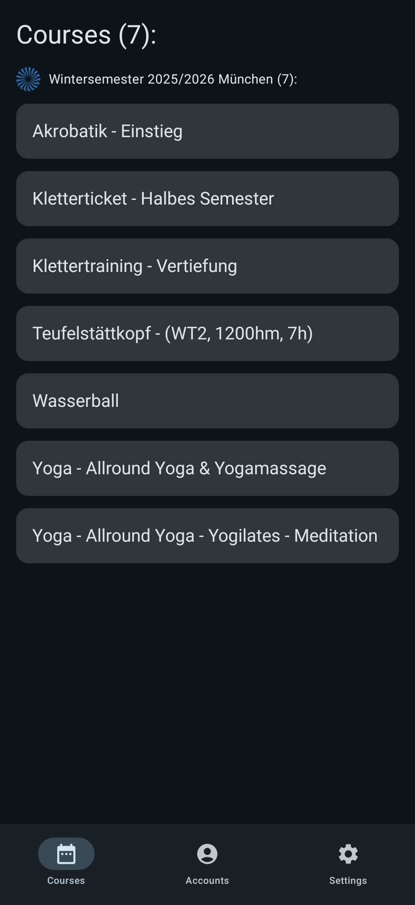
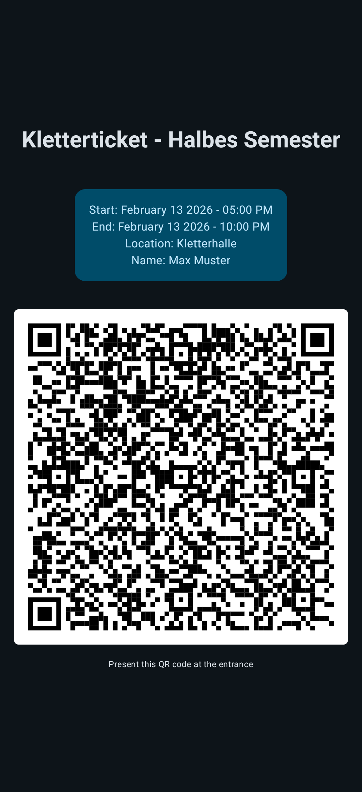
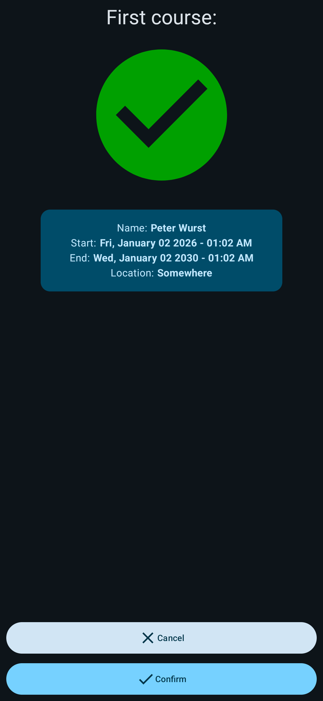

# UniThen

This android application is for doing the QR code check in (and a bit more) for [UniNow](https://uninow.com/) courses.
It can be used for any booking system hosted by them, e.g. for the [ZHS München](https://kurse.zhs-muenchen.de).

This app is **NOT** affiliated with UniNow GmbH, the provider/developer of the booking system.
If something with *this* app does not work, please contact [me](https://bixilon.de) and NOT UniNow. They can't and won't help you.

## Features

- Multiple sites and accounts
- QR Code Check in (presenting and scanning)
- List courses/appointments
- Really fast, no ads, no trackers
- Simple and small (~7MB; most of it is due to qr code scanning from [zxing-cpp](https://github.com/zxing-cpp/zxing-cpp))
- Completely offline (authenticate once)

## Download

The latest release is published on [gitlab releases](https://gitlab.bixilon.de/bixilon/unithen/-/releases). and on [F-Droid](https://f-droid.org/packages/de.bixilon.unithen). F-Droid builds are reproducible,
and signed with my key (SHA512: `f44dcdebfb54333fa205ff11eaa5aa1f47cde8217dd63a9fd979cd1fcf6d4241`) too. F-Droid is the preferred way, then you don't need to worry about updates.

(This app is Android only, iOS is **NOT** supported and won't be)

## Screenshots

| **Course overview**  | **QR Code Check In**  | QR Code Scanning  |
|:-----------------------------------------------------------------------------------------------------:|:----------------------------------------------------------------------------------------------:|:-------------------------------------------------------------------------------------------:|

## Why

So, the original [UniNow app](https://play.google.com/store/apps/details?id=de.mocama.UniNow) is not that bad (tries to be privacy friendly, works offline), but there are a few points that really bother me:

Doing simple things needs a lot of user interaction (e.g. when I want to do the check in):
Open app -> (wait) -> No I am not interested in improving the app -> (Must look at ads) -> My Studies -> ZHS -> (wait) -> Find the course -> (wait) -> Scroll down -> QR Code -> (wait)

And I don't want anything on my phone that I don't essentially need and that is not open source*.

## Under the hood

(Everything as simple as possible)

- Webview for loading UniNow website + sniff (and store) cookie
- Fetch user and page details and extract them from html (this could be improved with a dedicated api endpoint, did not touch the app yet)
- Get courses and appointments with GraphQL ([Schema](./doc/UniNow.graphql))
- Store everything locally in SQL database
- QR code scanning: Local copy of all enrolled users, queue for offline synchronization and [fts4](https://www.sqlite.org/fts3.html) for searching (actually kinda complex)

## Something is broken
Please report an [issue](https://gitlab.bixilon.de/bixilon/unithen/-/issues) (you must register for an account first), or send me a quick email to `bixilon [a.t] bixilon [dot.] de`

Every use case is different, mine is just checking in for sports courses and that works pretty much offline.

**Scanning QR codes was not tested yet, as I am not a course tutor**

## Releasing (Note for myself)

IntelliJ breaks reproducible builds, build with:

1. Update version code in `app/build.gradle.kts`
2. Create fastlane changelog
3. Update fdroid.txt with version information (then fdroid will build and deploy it automatically)
4. `git tag v1.2.3`
5. `./gradlew app:assembleRelease`
6. `apksigner sign --ks ~/Dokumente/androidkey.jks --alignment-preserved app-release-unsigned.apk` (`app/build/outputs/apk/release/app-release-unsigned.apk`)
7. `curl --location --header "PRIVATE-TOKEN: XXXXXX" --upload-file app-release-signed.apk "https://gitlab.bixilon.de/api/v4/projects/444/packages/generic/apk/VERSION/app-release.apk"`
8. `git push --tags` & create release
