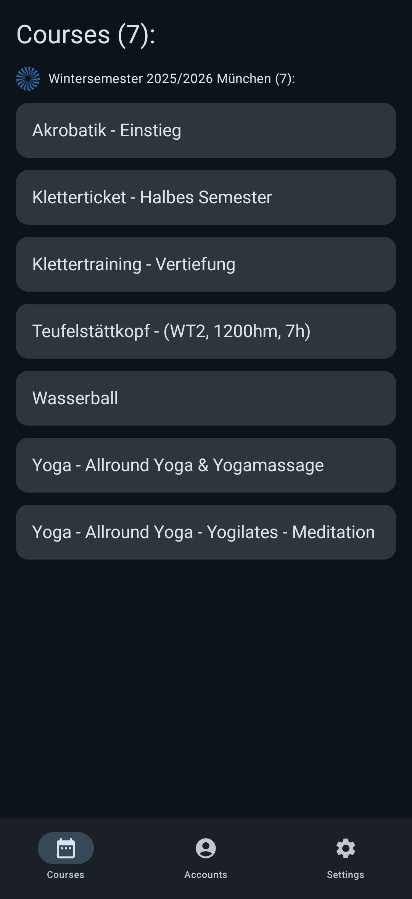
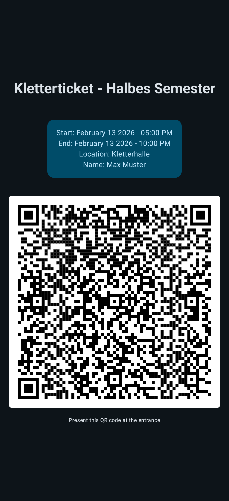
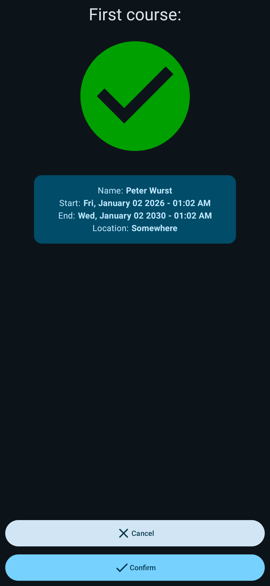

# UniThen

This app is for performing the QR code check in (and a bit more) for [UniNow](https://uninow.com/) courses.
It can be used for any digital booking system (DBS) hosted by them, e.g. for the [ZHS München](https://kurse.zhs-muenchen.de).

This app is **NOT** affiliated with UniNow GmbH, the provider/developer of the booking system.
If something with *this* app does not work, please contact [me](https://bixilon.de) and NOT UniNow. They can't and won't help you.

## Features

- Multiple sites and accounts
- QR Code check in (presenting and scanning)
- List of your courses
- Really fast, no ads, no trackers
- Simple and small (~4MB; most of it is due to qr code scanning from [zxing-cpp](https://github.com/zxing-cpp/zxing-cpp))
- Completely offline (authenticate once)

## Download

### Android

The latest release is published on [gitlab releases](https://gitlab.bixilon.de/bixilon/unithen/-/releases). and on [F-Droid](https://f-droid.org/packages/de.bixilon.unithen). F-Droid builds are reproducible,
and signed with my key (SHA512: `f44dcdebfb54333fa205ff11eaa5aa1f47cde8217dd63a9fd979cd1fcf6d4241`) too. F-Droid is the preferred way, then you don't need to worry about updates.
The app is **NOT** published on Google Play, as it _probably_ violates their policy.
Android 8+ is offically supported.

### iOS

The app is available on [AltStore (Classic)](https://faq.altstore.io/altstore-classic/how-to-install-altstore-windows), (just click here: [https://dl.bixilon.de/altstore/classic.json](altstore://source?url=https://dl.bixilon.de/altstore/classic.json) as source). As I don't have a paid Apple developer account, I am not able to notarize any version. Then AltStore PAL would be possible, which is a lot more convenient.
The app is **NOT** published in the AppStore, as it _probably_ violates their policy.
Every modern iOS version is supported (15.6+).

NOTE: iOS is tested, but might not be stable for every day usage. See [Issue #3](https://lipstick.bixilon.de/bixilon/unithen/-/issues/3) for known bugs. There is no stable release yet.

### Desktop
This app is ported to the jvm with compose multiplatform and runs on desktop, however this is a show off and not an offical supported platform. Please build it yourself.

## Screenshots

| **Course overview**  | **QR Code Check In**   |
|:-----------------------------------------------------------------------------------------------------:|:-----------------------------------------------------------------------------------------------:|
|      **Attendee List**       | **QR Code Scanning**  |

## Why

So, the original [UniNow app](https://play.google.com/store/apps/details?id=de.mocama.UniNow) is not that bad (tries to be privacy friendly), but there are a few points that really bother me:

Doing simple things needs a lot of user interaction (e.g. when I want to show my ticket for the check in):
Open app -> (wait) -> No I am not interested in improving the app -> (Must look at ads) -> My Studies -> ZHS -> (wait) -> Find the course -> (wait) -> Scroll down -> QR Code -> (wait)

And I don't want it on my phone :)
If somebody from UniNow sees this, please reach out **before** blocking the app off. I do not want to harm you (with this app). Maybe we can even collaborate? (There is [#4](https://gitlab.bixilon.de/bixilon/unithen/-/issues/4))

## Under the hood

(Everything as simple as possible)

- Ory authentication and webview as fallback for acquiring an access token
- Get page details (extract from html), and get user details
- Get courses and appointments with GraphQL ([Schema](./doc/UniNow.graphql))
- Store everything on your device in a SQL database
- QR code scanning: Local copy of all enrolled users, queue for offline synchronization and [fts4](https://www.sqlite.org/fts3.html) for searching (actually kinda complex)

## Something is broken
Please report an [issue](https://gitlab.bixilon.de/bixilon/unithen/-/issues) (you must register for an account first), or send me a quick email to `bixilon [a.t] bixilon [dot.] de`. I also appreciate feedback (positive or negative) :smile:

## License

This project is licensed under the term of the [General Public License v3 or later](./LICENSE.md). Some parts are excluded from this license:

- Logo (Usage only allowed in official builds, so if you hard fork this project please change the name and logo)
- All other logos (oicd, ...). They are the property of the corresponding organization.

Please check the license header of all files, and ask if in doubt.

## Code

All code is open source and licensed under the terms of the General Public Licence v3 or later. The source code can be retrieved on [gitlab.bixilon.de](https://gitlab.bixilon.de/bixilon/unithen). There is a [GitHub mirror](https://github.com/Bixilon/UniThen). Its only for code preservation, please don't report issues nor publish pull requests there.
